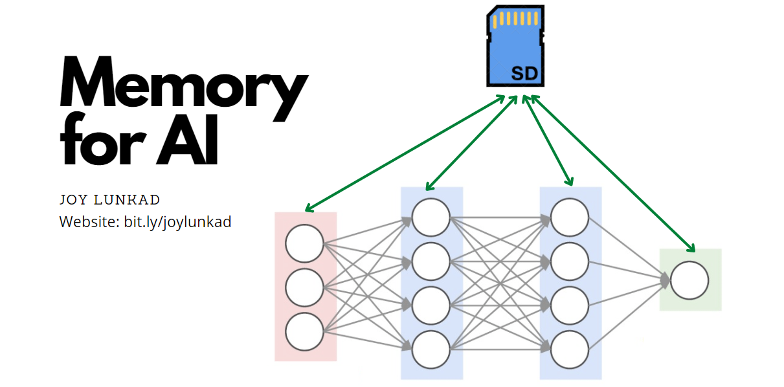
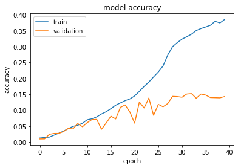

# Breakthrough: Can Giving Memory to Entire Neural Nets be Revolutionary?

3rd March, 2021


# What is it?

### You can think about AiM as an additional neural network that can latch on to almost any other CNN architecture and act as memory for that network.

(AiM comes from Memory for Artificial Intelligence.)

This can be best explained with a very straightforward and simple example.

Imagine if the AI is a student going through a book(dataset) and preparing for a test. All I am doing here is I tried giving it a notebook to write down whatever it thinks is important.      

A question that bothered me while learning about AI was what would happen if someone gave memory to the entire Neural Net? It sounds like its pretty obvious that it would work, right? I did just that and I am going to share with you, in detail, how I did it, how it works and the most important question of all, **Does it work**?

# Does it work?

The short answer : **YES**

I decided to train a standard ResNet50 as my base on the Stanford Dogs dataset and then added some memory to the exact same architecture, and trained it exactly in the same way as ResNet50. 



This is how **Standard ResNet50** performed, the highest the model reached was **15.14%** accuracy on test data. The training was stopped on the 40th epoch since the validation accuracy didn't increase in 7 epochs.


And this is how the same **AiM** **ResNet50** performed (AiM comes from Memory for Artificial intelligence). I only let it run till the 50th epoch. On its fiftieth epoch, it scored **20.06%** accuracy on the test data and it still had potential to go further ahead.  

This is just a guess but looking how the validation accuracy of the AiM ResNet50 does not fluctuate that much and just steadily rises, doesn't it look like not only it can learn more, but also it doesn't make that many mistakes in learning things from the dataset.

A ResNet50 has approximately **23.8 million parameters**. 

An aim-ResNet50 with a memory size of about 50,000 floats (which was used in the experiment above), has approximately **24.1 million parameters**. 

# How it works?

What my goal while making AiM was -

- Every Layer/Neuron/Unit should have a way to access the memory.
- The Neural Network should have a way to update the memory.
- The new updated memory should be passed on to next batches.

The way I implemented this was I decided to have a layer of 'memory' and pass that layer, along with the output of the previous layer, to the next layer, for every layer in the model. I also made update blocks for the "memory layer" so that the second condition is satisfied. The weights and the bias of this layer gave me a way to pass it on. 

# Initial Design

.png)

**This is where I started. The way the Conv2D layer acts as "Memory" for the entire Neural Net is a pretty simple idea.** 

A Convolutional Layer has weights and biases. When a tensor is given to it as input, the values from that tensor and these weights are multiplied and biases are added. This results in different feature maps for different inputs. **But what happens if the same input is fed to a Convolutional Layer? The same output every time. This output essentially serves as the memory in my design.** 

This memory has height, width and channels. By reshaping it and then padding it with zeros, we can concatenate it to any input going into any layer.

# Simplified Final Design


There was one major change in the final design I decided to implement :

## Memory Update Blocks

As you might recall, one of my goals while developing AiM was to give a way for the neural network to update the memory. 

### One question you might ask here could be, "Won't Backpropagation take care of updating the memory after every batch?"

And the answer is yes. The Initial Design might have worked without the memory update blocks.

This might sound bizarre at first.

But what I thought was : 

Going back to the example in which the AI is a student and this "memory" is its notebook. 

When we study, we don't wait for a lecture to get over to write notes about that lecture. We might update the notes once the lecture ends or maybe when we are going through the notes sometime later. Similarly, I wanted the AI to be able to write anything it wants in the notebook whenever it felt like it. **With the memory update block, It can write stuff in said notebook while its processing a batch. Backpropagation, on the other hand, might weed out wrong notes and add in notes that the AI missed at first.** 


AiM-ResNet Performance


Standard ResNet Performance

# Lets take a look at the code

You can find the code for ResNet50 written by keras-team here. It serves as the base for AiM-ResNet50

[keras-team/keras-applications](https://github.com/keras-team/keras-applications/blob/master/keras_applications/resnet50.py)

There are a only a few changes to this code to make a ResNet into an AiM-ResNet.

Needless to say, this piece of code has a lot of scope to improve. This was my very first attempt to create this and **this code's only purpose is to serve as a proof of concept**. In the near future, I am planning to try and make this code easy to read and use. 

Also, as you can see, I did not, at all, search for the best hyperparameters and with some thought and experiments, Aim-ResNet could perform even better than shown in this experiment.

```python
memory_channels = 1024
memory_shape = (7, 7, memory_channels)
total_m = memory_shape[0] * memory_shape[1] * memory_shape[2]
closest_perfect_square = find_closest_perfect_square(total_m)
memory_input = Input(shape = memory_shape)
Memory = Conv2D(memory_channels, (1,1), activation='linear')(memory_input)
# using a kernel size of (7,7) might be even better 
# as it would be faster and have more "memory".
```

```python
def memory_reshape_block(memory, target_shape, mem_shape, closest_perfect_square = closest_perfect_square):
    p_sq, sq = closest_perfect_square
    _, n_rows, n_cols, n_c = target_shape 
    m_rows, m_cols, m_c = mem_shape 
    
    total_m = m_rows * m_cols * m_c 
    total_t = n_rows * n_cols  

    if n_rows > sq: 

        x = layers.Reshape((total_m, 1))(memory)
        x = layers.ZeroPadding1D(padding = (p_sq - total_m)//2)(x)
        x = layers.Reshape((sq, sq, 1))(x)
        x = layers.ZeroPadding2D(padding = (n_rows - sq)//2 )(x)
        return x
    
    if total_t < total_m: 
        buckets = total_m//(n_rows*n_rows)
        x = layers.Reshape((n_rows, n_cols, buckets))(memory)
        return x
```

```python
def memory_update_block(input_tensor, memory_shape, Memory, filters, kernel_size, stage, block):
    
    filters1, filters2, filters3 = filters
    bn_axis = 3

    memory_name_base = 'Memory' + str(stage) + block + '_branch'
    memory_pad_base = 'mem_pad' + str(stage) + block + '_branch'
    concat_name_base = 'mem_concat' + str(stage) + block + '_branch'
    conv_name_base = 'mem_conv' + str(stage) + block + '_branch'
    pool_name_base = 'mem_pool' + str(stage) + block + '_branch'
    bn_name_base = 'mem_bn' + str(stage) + block + '_branch'

    _, n_rows, n_cols, n_c = input_tensor.shape 
    m_rows, m_cols, m_c = memory_shape

    memory_pad = memory_reshape_block(Memory, input_tensor.shape, memory_shape)

    concat = concatenate([input_tensor, memory_pad], name = concat_name_base) 

    x = Conv2D(filters = filters1, kernel_size = kernel_size, 
                           padding = 'same', kernel_initializer='he_normal', 
                           name = conv_name_base + '_a')(concat) 
    x = layers.BatchNormalization(axis=bn_axis, name=bn_name_base + '_2a')(x)
    x = layers.Activation('sigmoid')(x)

    x = Conv2D(filters = filters2, kernel_size = kernel_size,
                           padding = 'same', kernel_initializer='he_normal', 
                           name = conv_name_base + '_b')(x) 
    x = layers.BatchNormalization(axis=bn_axis, name=bn_name_base + '_2b')(x)
    x = layers.Activation('sigmoid')(x)

    x = Conv2D(filters = filters3, kernel_size = kernel_size, padding = 'same',
                           kernel_initializer='he_normal',
                           name = conv_name_base + '_c')(x) 
    x = layers.BatchNormalization(axis=bn_axis, name=bn_name_base + '_2c')(x)
    x = layers.Activation('sigmoid')(x)

    factor = (n_rows//m_rows, n_cols//m_cols)
    x = AveragePooling2D(pool_size=factor,strides=factor)(x)
    Memory = Conv2D(filters=m_c, kernel_size=(1, 1), strides=(1,1), padding='same', name = memory_name_base)(x) 
    return Memory
```

```python
def identity_block(input_tensor, kernel_size, filters, stage, block, memory, memory_shape=memory_shape):
    """The identity block is the block that has no conv layer at shortcut.
    # Arguments
        input_tensor: input tensor
        kernel_size: default 3, the kernel size of
            middle conv layer at main path
        filters: list of integers, the filters of 3 conv layer at main path
        stage: integer, current stage label, used for generating layer names
        block: 'a','b'..., current block label, used for generating layer names
    # Returns
        Output tensor for the block.
    """
    filters1, filters2, filters3 = filters
    
    memory_name_base = 'memory' + str(stage) + block + '_branch'
    memory_pad_base = 'memory_pad' + str(stage) + block + '_branch'
    concat_name_base = 'concat' + str(stage) + block + '_branch'
    conv_name_base = 'res' + str(stage) + block + '_branch'
    bn_name_base = 'bn' + str(stage) + block + '_branch'
    
    bn_axis = 3

    memory_pad = memory_reshape_block(Memory, input_tensor.shape, memory_shape)                       
    concat = layers.concatenate([input_tensor, memory_pad])

    x = layers.Conv2D(filters1, (1, 1),
                      kernel_initializer='he_normal',
                      name=conv_name_base + '2a')(concat)
    x = layers.BatchNormalization(axis=bn_axis, name=bn_name_base + '2a')(x)
    x = layers.Activation('relu')(x)

    x = layers.Conv2D(filters2, kernel_size,
                      padding='same',
                      kernel_initializer='he_normal',
                      name=conv_name_base + '2b')(x)
    x = layers.BatchNormalization(axis=bn_axis, name=bn_name_base + '2b')(x)
    x = layers.Activation('relu')(x)

    x = layers.Conv2D(filters3, (1, 1),
                      kernel_initializer='he_normal',
                      name=conv_name_base + '2c')(x)
    x = layers.BatchNormalization(axis=bn_axis, name=bn_name_base + '2c')(x)

    x = layers.add([x, input_tensor])
    x = layers.Activation('relu')(x)
    return x
```

```python
def conv_block(input_tensor,kernel_size,
               filters,stage,block,memory,
               strides=(2, 2),
               memory_shape=memory_shape):

    """A block that has a conv layer at shortcut.
    # Arguments
        input_tensor: input tensor
        kernel_size: default 3, the kernel size of
            middle conv layer at main path
        filters: list of integers, the filters of 3 conv layer at main path
        stage: integer, current stage label, used for generating layer names
        block: 'a','b'..., current block label, used for generating layer names
        strides: Strides for the first conv layer in the block.
    # Returns
        Output tensor for the block.
    Note that from stage 3,
    the first conv layer at main path is with strides=(2, 2)
    And the shortcut should have strides=(2, 2) as well
    """
    filters1, filters2, filters3 = filters
    bn_axis = 3

    memory_name_base = 'memory' + str(stage) + block + '_branch'
    memory_pad_base = 'memory_pad' + str(stage) + block + '_branch'
    concat_name_base = 'concat' + str(stage) + block + '_branch'
    conv_name_base = 'res' + str(stage) + block + '_branch'
    bn_name_base = 'bn' + str(stage) + block + '_branch'

    memory_pad = memory_reshape_block(memory, input_tensor.shape, memory_shape)                                  
    concat = layers.concatenate([input_tensor, memory_pad], name = concat_name_base)

    x = layers.Conv2D(filters1, (1, 1), strides=strides,
                      kernel_initializer='he_normal',
                      name=conv_name_base + '2a')(concat)
    x = layers.BatchNormalization(axis=bn_axis, name=bn_name_base + '2a')(x)
    x = layers.Activation('relu')(x)

    x = layers.Conv2D(filters2, kernel_size, padding='same',
                      kernel_initializer='he_normal',
                      name=conv_name_base + '2b')(x)
    x = layers.BatchNormalization(axis=bn_axis, name=bn_name_base + '2b')(x)
    x = layers.Activation('relu')(x)

    x = layers.Conv2D(filters3, (1, 1),
                      kernel_initializer='he_normal',
                      name=conv_name_base + '2c')(x)
    x = layers.BatchNormalization(axis=bn_axis, name=bn_name_base + '2c')(x)

    shortcut = layers.Conv2D(filters3, (1, 1), strides=strides,
                             kernel_initializer='he_normal',
                             name=conv_name_base + '1')(input_tensor)
    shortcut = layers.BatchNormalization(
        axis=bn_axis, name=bn_name_base + '1')(shortcut)

    x = layers.add([x, shortcut])
    x = layers.Activation('relu')(x)
    return x
```

```python
def ResNet50(include_top=True,
             input_shape=None,
             memory_input=None,
             classes=100,
             **kwargs):

    img_input = layers.Input(shape=input_shape, name = 'image_input')
    bn_axis = 3

    MEMORY = Conv2D(memory_channels, (1,1), activation='linear', name='mem_init')(memory_input)

    x = layers.ZeroPadding2D(padding=(3, 3), name='conv1_pad')(img_input)
    x = layers.Conv2D(64, (7, 7),
                      strides=(1, 1),
                      padding='valid',
                      kernel_initializer='he_normal',
                      name='conv1')(x)
    x = layers.BatchNormalization(axis=bn_axis, name='bn_conv1')(x)
    x = layers.Activation('relu')(x)
    x = layers.ZeroPadding2D(padding=(1, 1), name='pool1_pad')(x)
    x = layers.MaxPooling2D((3, 3), strides=(2, 2))(x)

    x = conv_block(x, 3, [64, 64, 256], stage=2, block='a', strides=(1, 1), memory = MEMORY)
    MEMORY = memory_update_block(x, memory_shape, MEMORY, [16, 16, 32], (3,3), stage=2, block='a')

    x = identity_block(x, 3, [64, 64, 256], stage=2, block='b', memory = MEMORY)
    x = identity_block(x, 3, [64, 64, 256], stage=2, block='c', memory = MEMORY)
    x = conv_block(x, 3, [128, 128, 512], stage=3, block='a', memory = MEMORY)
    MEMORY = memory_update_block(x, memory_shape, MEMORY, [16, 16, 32], (3,3), stage=3, block='a')

    x = identity_block(x, 3, [128, 128, 512], stage=3, block='b', memory = MEMORY)
    x = identity_block(x, 3, [128, 128, 512], stage=3, block='c', memory = MEMORY)
    x = identity_block(x, 3, [128, 128, 512], stage=3, block='d', memory = MEMORY)
    x = conv_block(x, 3, [256, 256, 1024], stage=4, block='a', memory = MEMORY)
    MEMORY = memory_update_block(x, memory_shape, MEMORY, [16, 16, 32], (3,3), stage=4, block='a')

    x = identity_block(x, 3, [256, 256, 1024], stage=4, block='b', memory = MEMORY)
    x = identity_block(x, 3, [256, 256, 1024], stage=4, block='c', memory = MEMORY)
    x = identity_block(x, 3, [256, 256, 1024], stage=4, block='d', memory = MEMORY)
    x = identity_block(x, 3, [256, 256, 1024], stage=4, block='e', memory = MEMORY)
    x = identity_block(x, 3, [256, 256, 1024], stage=4, block='f', memory = MEMORY)
    x = conv_block(x, 3, [512, 512, 2048], stage=5, block='a', memory = MEMORY)
    MEMORY = memory_update_block(x, memory_shape, MEMORY, [16, 16, 32], (3,3), stage=5, block='a')

    x = identity_block(x, 3, [512, 512, 2048], stage=5, block='b', memory = MEMORY)
    x = identity_block(x, 3, [512, 512, 2048], stage=5, block='c', memory = MEMORY)

    if include_top:
        x = layers.GlobalAveragePooling2D(name='avg_pool')(x)
        x = layers.Dense(classes, activation='softmax', name='fc1000')(x)
    else:
        if pooling == 'avg':
            x = layers.GlobalAveragePooling2D()(x)
        elif pooling == 'max':
            x = layers.GlobalMaxPooling2D()(x)
        else:
            warnings.warn('The output shape of `ResNet50(include_top=False)` '
                          'has been changed since Keras 2.2.0.')

    inputs = [img_input, memory_input]
    # Create model.
    model = tf.keras.Model(inputs, x, name='aim_resnet50')

    return model

model = ResNet50(include_top=True, input_shape=(224,224,3), classes=NUM_CLASSES, memory_input=memory_input)
```

You can find exactly how the model looks with all the shapes if you follow this [link](https://drive.google.com/file/d/1XDhhHGHwmp9AIj_8Nb2ZI8SQXZxRVevL/view?usp=sharing)

# How versatile is it?

Just one look at the method with which it is implemented, its easy to conclude that, memory can be added to most CNNs and Fully Connected Neural Network architectures with minimal changes. I have tested adding memory to ResNet50 and VGG16 and if it improves their performance, **there is a good chance that this might actually improve almost every single deep neural network architecture out there**. 

# Conclusion

I have high hopes for this seemingly simple yet effective idea. Though this experiment is crude and has room for lots of improvement, I wanted, with this post, to bring your attention to this proof of concept.

I love how the deep learning community is so supportive and helpful. So many papers and codes and helpful blog posts and notebooks are out here for free, I thought the best way to give back, would be to make this public. 

I would love to hear your opinions on my work and I can't wait to see how the deep learning community develops this idea further.

[To Contact Me or to know more about me](https://www.notion.so/To-Contact-Me-or-to-know-more-about-me-8e6512526e8b4d4fa29e8b573992c370)
